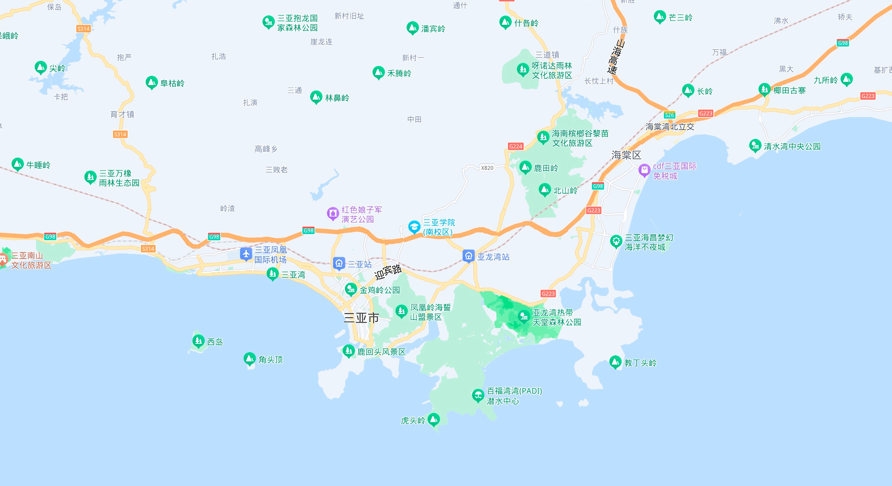

# 三亚旅游计划

## 地理位置

三亚，全市面积1919.21平方公里，地处海南岛最南端，位于北纬18°09′34″——18°37′27″、东经108°56′30″——109°48′28″之间。是中国唯一的国际性热带滨海度假胜地。
三亚北靠高山，南临大海，地势自北向南逐渐倾斜，形成一个狭长状的多角形。境内有大小港湾19个。有大小岛屿40个，主要岛屿10个，面积最大的岛屿西瑁岛和东瑁岛，
目前西瑁岛和蜈支洲岛已开发成为著名的旅游景区。

;

## 历史

三亚是一个几乎没什么历史的地方，从一个小破地方，借助着改革开放的红利迅速发展起来。

- 三亚早在西汉元封元年（公元前110年）就序列于中国版图。其建置演变先后为：临振县、临振郡、振州、崖州（宋）、珠崖军、吉阳军、崖州（明）等。
- 清光绪三十一年（1905年），升崖州为直隶州，领万安、陵水、昌化、感恩四县。民国元年（1912年）废直隶州，设崖县。1958年，崖县县治从崖城迁至三亚。
- 1984年5月，撤销崖县，以崖县行政区设立三亚市（县级）。1987年11月，三亚市升格为地级市。
- 三亚陆地总面积1919平方公里，是一个黎、苗、回、汉多民族聚集的地区。三亚市的地貌有山有海有河，北面环山，南面临海。
- 三亚地名的由来与三亚河的名称紧密相联。三亚市境内有中小河流12条，集雨面积最大的宁远河、藤桥河；其次为三亚河、大茅水、龙江水等。
- 三亚河，由六罗水、水蛟溪、半岭水三条河组成，以六罗水为主流，发源于三亚市和保亭黎族苗族自治县交界的中间岭右侧高山南麓，自北向南流，经三亚市区注入三亚港入海，流程28．8公里，流域面积337．02平方公里。
- 2019年10月23日，被确定为“第三批城市黑臭水体治理示范城市”。

## 人文

三亚有大量的黎族百姓，所以传统文化基本都是黎族的特色文化。

**黎族鼻箫技艺传承人在进行演奏**

**黎族织锦技艺**

**黎族藤编技艺**

## 美食

#### 海南东山羊

海南东山羊，由于主产于海南万宁的东山岭，所以被当地人简称为“东山羊”，东山羊以优质的羊肉而闻名岛内外，它与加积鸭、和乐蟹、文昌鸡被人们并称为海南四大名菜。
海南人无论娶嫁寿丧，还是过年过节，均是“无羊不成宴”，少不了的一道菜就是“东山羊”，不管是红焖、清汤、椰汁、干煸或是火锅涮，这羊肉吃起来就是那么的鲜美。

地 址：三亚市区胜利路鸿港市场2楼(近建港路)

#### 海南和乐蟹

海南四大名菜之一。在和乐镇，以港北、乐群村一带的 螃蟹最有名，其膏满肉肥为其它蟹种罕见，特别是脂膏，金黄油亮，如咸鸭蛋黄，富含营养。

地 址：三亚市三亚河西路287号(春园海鲜广场正对面)

#### 海南文昌鸡

四大名菜之首，因产于文昌市得名。据传，文昌鸡最早出自当地谭牛镇天赐村，此村盛长榕树，家鸡长期啄树籽为食，皮黄且脆，柔嫩且美，骨酥且鲜。
海南人传统的吃法是白切，沾佐料食用，入口喷香，爽滑异常。同时配以鸡油鸡汤煮的米饭，俗称“鸡饭”。

地 址：三亚市金茂三亚丽思卡尔顿酒店1楼东侧

#### 椰子饭

海南特色美食之一，是海南传统农家小吃。又名椰子船，是由海南优质糯米、天然椰肉和椰汁一同蒸熟而成，现在多把它做为主食的一种。在这个椰影婆娑的城市，
品尝地道的椰子饭，别有一番风味。

地 址：三亚市河西区 新民街152号(近第一市场)

#### 清补凉

清补凉据说发源于琼海，椰奶风味的只有琼海有。清补凉各食材入碗后浇一大勺浓浓的椰奶，如果放上两大坨专门调制的冰淇淋，再洒一点干花生，看着就流口水，
吃到嘴里整个鼻腔口腔都是香。

地 址：三亚市区外贸路（友谊街口）

#### 黄流老鸭

黄流老鸭的做法很多，但最适合大众胃口还是白斩老鸭，吃老鸭一定要就店里做好的酱料才会更好吃。“白斩”（又称“白切”）黄流老鸭皮白肉厚，鸭子香气诱人，
最能体现原汁原味。

地 址：三亚胜利路海港市场旁（光明路口）

#### 陵水酸粉

陵水酸粉是海南省的一种特色小吃，跟海南粉类似，不过其中添加了特制的酱汤，酸辣甜香，佐料丰富，味道极其鲜美，令人回味。

地 址：三亚市河西区解放路新风街26号(近国安局)

#### 抱罗粉

海南省以大米为主要粮食作物，因而米粉类小吃在海南就十分普遍，抱罗粉就是其中的一个代表。抱罗粉因盛起文昌市的抱罗镇得名，抱罗粉美味全在于骨汤的合理调配，
柔软爽滑、汤汁味美。现在的抱罗粉的粉汤还吸收了粤菜上汤的制法，粉汤更为的鲜美可口。

地 址：三亚市河西区第一海鲜市场内

#### 生猛海鲜

地 址：三亚市河西区第一海鲜市场

#### 海南加积鸭

海南四大名菜之一。加积鸭盛产于海南琼海市加积镇，形体扁平，红冠黄蹼，羽毛黑白相间。由于饲养方法殊异，故其脯大、皮薄、骨软、肉嫩、脂肪少、食之肥而不腻，
营养价值高。加积鸭的烹制方法多种多样，但以“白斩”（又称“白切”）最能体现原汁原味。

地 址：三亚市河西区胜利路467号(近汽车总站旺豪超市)

### 注意事项

1. 吃海鲜注意些什么：
   1. 椰子和海鲜不宜同食。
   2. 吃海鲜时，适量喝点白酒和米醋，但吃海鲜不宜喝啤酒。
2. 吃热带水果注意事项：
   1. 热带水果不能贪吃，很容易上火。
   2. 空腹不能吃菠萝、杨桃。特别是有糖尿病的人更不能吃杨桃，会有生命危险。
   3. 血脂高少吃榴莲、椰子、鳄梨，计算一下脂肪含量就会发现，这三种水果的“含油量”高得吓人。不过，喝椰子水则另当别论。椰子水不含胆固醇，只是糖分偏高，糖尿病病人最好少喝。
   4. 海南岛的椰子有青椰、黄椰和红椰之分，以红椰为上品。上午10点到中午12点这个时段的椰汁最甜，此时喝椰汁最为适宜。
3. 在三亚吃海鲜要是吃不准价格的话，可以到三亚物价局官网上查看当天的海鲜物价
4. 虽然排挡上提供的冰冻椰子很诱人，只要3元一个，但是最好不要吃——椰子和海鲜不宜同食。
5. 很关键的一点哦，在三亚乃至整个海南，在任何一个服务场所请不要称女服务生为小姐，标准的称呼是叫——小妹。再附带说一句，除了吃海鲜以外。
6. 所有的海鲜在第一市场去购买的话，价格会便宜20-30%左右，但是那里的环境不是很好，还有很多的小偷，一定要注意自己财产的安全，为了吃顿海鲜丢了东西不值得。
7. 千万不要让人力三轮车拉去吃饭，会被宰。

## 气候 气温

下图，2022年一整年的气温曲线图。

## 景观

景点分布概览

#### 蜈支洲岛

- 门票:140
- 开放时间:8:00—18: 30
- 出行交通:28路公交
- 附近美食:嗲嗲的椰子鸡

#### 热带天堂森林公园

- 门票:158
- 开放时间: 7:30—18: 00
- 出行交通:15/25路公交
- 附近美食:海阔天空泰餐厅

#### 椰梦长廊

- 门票:免费
- 开放时间:全天
- 出行交通:8/26路公交
- 附近美食:琼乡阁海南菜

- 门票:122
- 开放时间:8:30—17:00
- 出行交通:16路公交
- 附近美食:缘起楼素斋餐厅张超震撼的108米海上观音

#### 西岛

- 门票:90
- 开放时间:8:00—17: 30
- 出行交通:16/26路公交
- 附近美食:西岛休闲餐厅瞧超美的海岛渔村风光!

#### 天涯海角

- 门票:66
- 开放时间:7: 30—18: 20
- 出行交通:16/26路公交
- 附近美食:城外有星光海景餐厅

#### 亚特兰蒂斯水世界

- 门票:298
- 开放时间:10: 00—18: 00
- 交通出行:35路公交
- 附近美食:深海宴海鲜

#### 后海村

- 门票:免费
- 开放时间:全天
- 交通出行:35路公交
- 附近美食:黎家宴海南黎族

#### 三亚免税城

- 门票:免费
- 开放时间:10: 00—22: 00
- 出行交通:34路公交

## 交通

没有地铁，主要做公交。

## 住宿

TODO

## 路线规划

TODO

## 时间安排

TODO

## 来回交通
